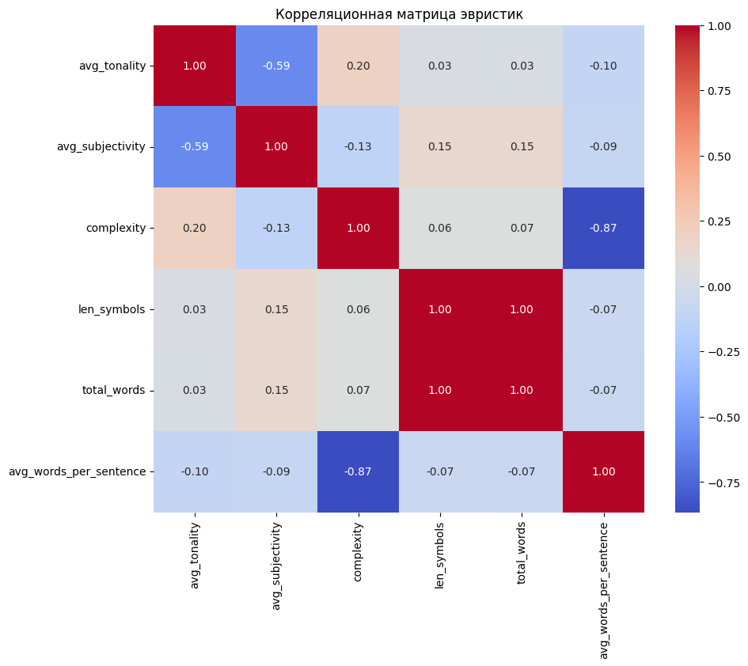

# Построение бейзлайна и пайплайна

Основные расчеты приведены в ноутбуке - `notebooks/baseline_experiments.ipynb`

Основной пайплайн лучшей модели в ноутбуке - 'notebooks/baseline_pipeline.ipynb'

Базовый вариант ноутбука - `notebooks/baseline_notebook.ipynb`. 

Все эвристики были рассчитаны но основе очищеных полных текстов. 

---

**Lexicon-based эвристики:**
* Тональность текста (`tonality`)
* Субъективность текста (`subjectivity`)
* Токсичность текста (`toxicity_score`)

Первые две были расчитаны с помощью модуля `TextBlob`, токсичность решили исключить из эвристик, поскольку она не была выявлена в нашем датасете. 

Были вычислены в качестве стилистических эвристик средние значения для каждого автора (чтобы избежать шумов и выбросов в рамках отдельных текстов).

---

**Rule-based эвристики:**
* Сложность текстов (`complexity`)
* Количество символов в тексте (`len_symbols`)
* Количество слов в тексте (`total_words`)
* Среднее количество слов в предложении (`avg_words_per_sentence`)

---

**Корреляционная матрица**

Для проверки взаимосвязи между эвристиками построили корреляционную матрицу:



Была выявлена сильная взаимосвязь между `len_symbols` и `total_words`, поэтому оставили только `total_words` (посчитали, что признак является более интерпретируемым).

Также есть взаимосвязь между `avg_words_per_sentence` и `complexity` (чем меньше слов в предложении - тем текст проще). Оставим `avg_words_per_sentence`.

---
**Обучение моделей**

Выбрали 3 подхода к обучению моделей:
* Только на эвристиках
* Только на текстовых признаках
* Комбинированный подход
  
На этапе обучения модели будем рассматривать все возможные подходы. Для преобразования текстовых данных в числовую форму применен подход *Bag of Words (BoW)* с помощью `CountVectorizer`. Учитываются униграммы и биграммы, максимум 500 признаков. BoW выбран как самый очевидный метод.

Тестовая и тренировочная выборки разделены как 20% на 80% случайным образом.

В качестве моделей использовались:
- SVC (Support Vector Classifier) - метод опорных векторов. Нахождение гиперплоскости, максимально разделяющей данные классов. Расстояние от гиперплоскости до ближайших точек классов называется margin. SVM оптимизирует гиперплоскость, чтобы максимизировать этот margin.
- LogisticRegression - логистическая регрессия.
- DecisionTreeClassifier - дерево решений. Модель машинного обучения, которая разбивает данные на подмножества на основе заданных условий, чтобы прийти к какому-либо заключению.

Рассмотрим полученные результаты после обучения:

>**1. Только эвритиски:**

```
SVC:
- Accuracy: 1.0
- Precision: 1.0
- Recall: 1.0
- F1 Score: 1.0

Log.Regression:
- Accuracy: 0.90
- Precision: 0.89
- Recall: 0.90
- F1 Score: 0.89

Decision Tree:
- Accuracy: 0.75
- Precision: 0.68
- Recall: 0.75
- F1 Score: 0.70
```
>**2. Только текстовые признаки:**

```
SVC:
- Accuracy: 0.75
- Precision: 0.78
- Recall: 0.75
- F1 Score: 0.76

Log.Regression:
- Accuracy: 0.82
- Precision: 0.83
- Recall: 0.82
- F1 Score: 0.82

Decision Tree:
- Accuracy: 0.48
- Precision: 0.49
- Recall: 0.48
- F1 Score: 0.41
```

>**3. Комбинированный подход:**

```
SVC:
- Accuracy: 0.82
- Precision: 0.85
- Recall: 0.82
- F1 Score: 0.83

Log.Regression:
- Accuracy: 0.86
- Precision: 0.87
- Recall: 0.86
- F1 Score: 0.86

Decision Tree:
- Accuracy: 0.75
- Precision: 0.68
- Recall: 0.75
- F1 Score: 0.70
```

---

**Пайплайн**

На этапе проведения экспериментов было выявлено, что лучшие метрики качества выдавает логистическая регрессия, поэтому пайплайн строили на основе этой модели.

```python
pipeline = Pipeline([
    ('scaler', StandardScaler()),
    ('classifier', LogisticRegression(max_iter=1000, random_state=42))
])
```

Результаты следующие:
```
- Accuracy: 0.936
- Precision: 0.935
- Recall: 0.936
- F1 Score: 0.935
```
По итогу на комбинированном наборе фичей (эвристики + текстовые) логистическая регрессия показала значения метрик точности предсказания в районе 93%.
