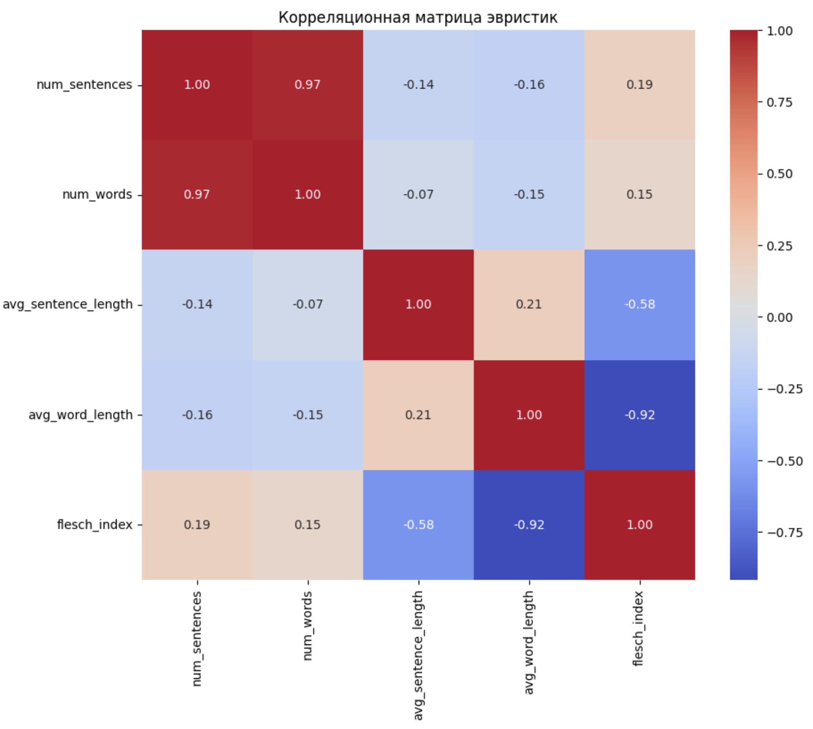

# Построение бейзлайна и пайплайна

Основные расчеты приведены в ноутбуке - `notebooks/baseline_experiments_v2.ipynb`

Основной пайплайн лучшей модели в ноутбуке - `notebooks/baseline_pipeline.ipynb`

Все эвристики были рассчитаны но основе очищеных полных текстов. 

---

**Lexicon-based эвристики:**

Изначально были рассчитаны тональность, субъективность и токсичность текстов. Однако было принято решение отказаться от данных метрик. Наша задача включает массивные тексты, которые известные предобученные модели на русскоязычном корпусе не могут обработать полностью (как правило, учитываются только $512$ токенов). Из-за этого большая часть информации теряется, и скоры $\text{Lexicon-based}$ эвристик могут давать невалидную интерпретацию.

---

**Rule-based эвристики:**
* Количество слов в тексте (`num_words`)
* Количество предложений в тексте (`num_sentences`)
* Средняя длина слов (`avg_word_length`)
* Среднее количество слов в предложении (`avg_sentence_length`)
* Сложность текстов - индекс Флеша (`flesch_index`)

---

**Корреляционная матрица**

Для проверки взаимосвязи между эвристиками построили корреляционную матрицу:



Была выявлена сильная взаимосвязь между `num_sentences` и `num_words`, поэтому оставили только `num_words` (посчитали, что признак является более интерпретируемым).

Также есть взаимосвязь между индексом Флеша `flesch_index` и средними значениями, через которые он линейно выражается. Оставим средние значения `avg_word_length` и `avg_sentence_length`.

---
**Обучение моделей**

Выбрали 3 подхода к обучению моделей:
* Только на эвристиках
* Только на текстовых признаках
* Комбинированный подход
  
На этапе обучения модели будем рассматривать все возможные подходы. Для преобразования текстовых данных в числовую форму применен подход *Bag of Words (BoW)* с помощью `CountVectorizer`. Учитываются униграммы и биграммы. BoW выбран как самый очевидный метод. Были протестированы с помощью модели `MultinomialNB` различные размеры словаря - чем больше значение, тем выше точность. Было принято решение рассмотреть значение в $5000$.

Тестовая и тренировочная выборки разделены как 20% на 80% случайным образом.

В качестве моделей использовались:
- `SVC` (Support Vector Classifier) - метод опорных векторов. Нахождение гиперплоскости, максимально разделяющей данные классов. Расстояние от гиперплоскости до ближайших точек классов называется margin. SVM оптимизирует гиперплоскость, чтобы максимизировать этот margin.
- `LogisticRegression` - логистическая регрессия.
- `DecisionTreeClassifier` - дерево решений. Модель машинного обучения, которая разбивает данные на подмножества на основе заданных условий, чтобы прийти к какому-либо заключению.

Рассмотрим полученные результаты после обучения:

>**1. Только эвристики:**

```
SVC:
- Accuracy: 0.22
- Precision: 0.16
- Recall: 0.22
- F1 Score: 0.15

Log.Regression:
- Accuracy: 0.21
- Precision: 0.15
- Recall: 0.21
- F1 Score: 0.15

Decision Tree:
- Accuracy: 0.31
- Precision: 0.27
- Recall: 0.31
- F1 Score: 0.28
```
>**2. Только текстовые признаки:**

```
SVC:
- Accuracy: 0.77
- Precision: 0.77
- Recall: 0.77
- F1 Score: 0.77

Log.Regression:
- Accuracy: 0.84
- Precision: 0.85
- Recall: 0.84
- F1 Score: 0.84

Decision Tree:
- Accuracy: 0.5
- Precision: 0.56
- Recall: 0.5
- F1 Score: 0.46
```

>**3. Комбинированный подход:**

```
SVC:
- Accuracy: 0.79
- Precision: 0.79
- Recall: 0.79
- F1 Score: 0.78

Log.Regression:
- Accuracy: 0.85
- Precision: 0.86
- Recall: 0.85
- F1 Score: 0.84

Decision Tree:
- Accuracy: 0.5
- Precision: 0.57
- Recall: 0.5
- F1 Score: 0.46
```

---

**Пайплайн**

На этапе проведения экспериментов было выявлено, что лучшие метрики качества выдает логистическая регрессия на комбинированном подходе, поэтому пайплайн построен на основе этой модели.

```python
pipeline = Pipeline([
    ('scaler', StandardScaler()),
    ('classifier', LogisticRegression(max_iter=1000, random_state=42))
])
```

Результаты следующие:
```
- Accuracy: 0.8089
- Precision: 0.8092
- Recall: 0.8089
- F1 Score: 0.8081
```
По итогу на комбинированном наборе фичей (эвристики + текстовые признаки) логистическая регрессия показала значения метрик точности предсказания в районе $81\%$.
