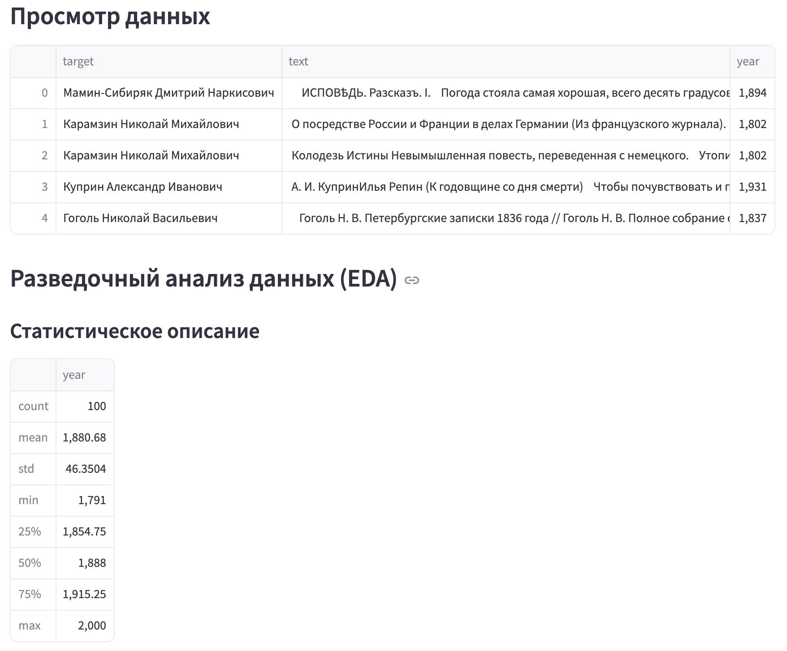
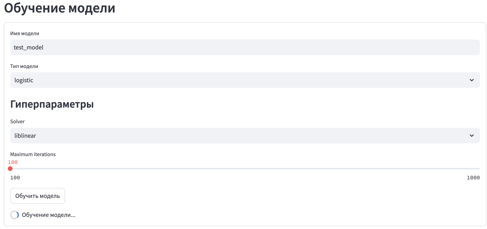
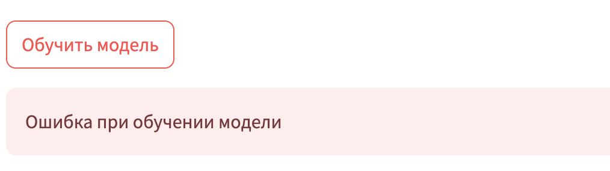
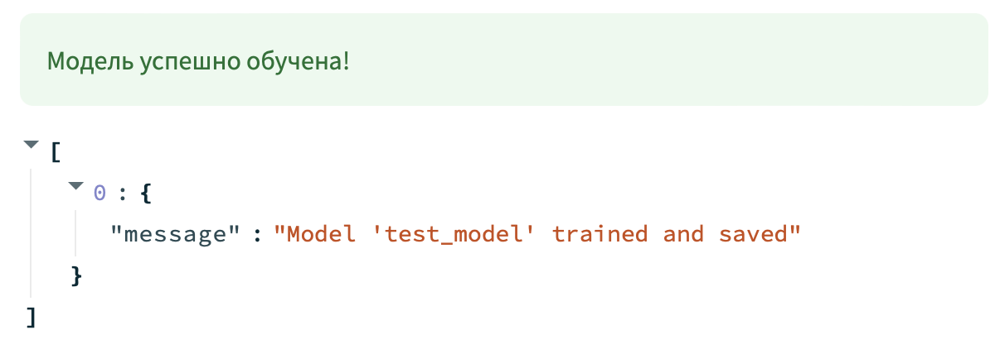
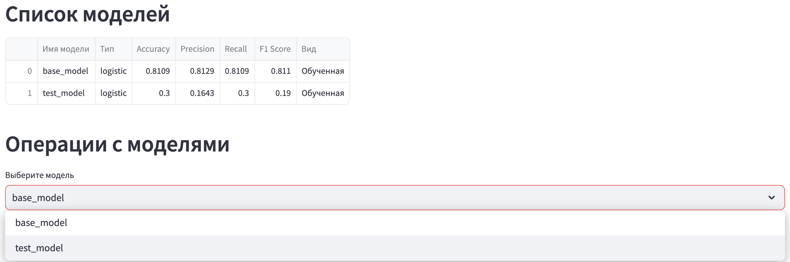

# Документация проекта

---

## 🗂️ Структура проекта

В корне расположены следующие основные директории проекта:
- `api_backend`: серверная часть, реализующая функционал API;
- `client`: клиентская часть, реализующая функционал Streamlit-приложения;
- `data`: вспомогательные материалы (например, скриншоты для отчетов);
- `notebooks`: .ipynb ноутбуки, содержащие анализ данных, эксперименты и тесты;
- `parser`: реализация загрузки исходного датасета текстов отечественных классиков.

Также отображены отчетные файлы `.md` к различным чекпойнтам.

---

## 🛠 Реализация серверной части

Директория `api_backend` представляет собой ядро серверной части проекта, включающее в себя реализацию API, бизнес-логику, маршрутизацию и управление данными. 

Ниже приведено описание основных компонентов:

>**[main.py](https://github.com/DAChernikov/AuthDef_group_project/blob/5c974d7d4b49d3fad7c1f879d2e688e6317c28f9/api_backend/main.py)**

Инициализация FastAPI приложения, точка входа в серверную часть проекта.

>**[requirements.txt](https://github.com/DAChernikov/AuthDef_group_project/blob/5c974d7d4b49d3fad7c1f879d2e688e6317c28f9/api_backend/requirements.txt)**

Файл содержит список зависимостей, необходимых для работы серверной части проекта. 

### 📂 **/serializers**

>**[serializers.py](https://github.com/DAChernikov/AuthDef_group_project/blob/5c974d7d4b49d3fad7c1f879d2e688e6317c28f9/api_backend/serializers/serializers.py)**

Описание классов-моделей `pydantic`, которые определяют структуру запросов и ответов сервиса.

Используется для валидации входных данных и стандартизации формата ответов.

### 📂 **/services**

Содержит вспомогательные модули для реализации основого функционала сервиса.

>**[metrics.py](https://github.com/DAChernikov/AuthDef_group_project/blob/5c974d7d4b49d3fad7c1f879d2e688e6317c28f9/api_backend/services/metrics.py)**

Файл содержит функции, направленные на предобработку сырого текста:
* очистка от лишних символов / пробелов;
* токенизация;
* лемматизация;
* векторизация с помощью модели `Word2Vec`;
* вычисление числовых признаков текста (количество слов, средняя длина предложений, средняя длина слов).

>**[model_history.py](https://github.com/DAChernikov/AuthDef_group_project/blob/5c974d7d4b49d3fad7c1f879d2e688e6317c28f9/api_backend/services/model_history.py)**

Функции для управления и регистрации моделей в сервисе.

### 📂 **/api/v1**

Директория отвечает за маршрутизацию запросов в серверной части проекта. 

>**[api_route.py](https://github.com/DAChernikov/AuthDef_group_project/blob/5c974d7d4b49d3fad7c1f879d2e688e6317c28f9/api_backend/api/v1/api_route.py)**

Файл инициализации роутера и ручек сервиса.

Содержит также вспомогательные функции для декомпозиции кода:
- `prepare_pipeline`: на основе типа модели и ее конфигураций возвращает объект `sklearn.pipeline` со стандартизатором. На данный момент поддерживается только тип `logistic`;
- `process_texts`: очищает входные тексты (используя функции предобработок из `/service/metrics.py`), учитывая поступивший список авторов из целевой переменной. Возвращает очищенный текст, а также леммы;
- `prepare_features`: подготавливает данные для дальнейшего обучения модели - список лемм и числовые признаки на основе очищенного текста.

Перечень ручек сервиса:
- `/fit_csv`: обучает модель на основе загруженного пользователем CSV файла. Включает предобработку текстов и формирование пайплайна на основе вспомогательных функций. Далее разделяет данные на тренировочную и тестовую выборку, применяет векторизацию токенов, обучает пайплайн и вычисляет метрики качества, сохраняя модель в хранилище и регистрируя модель и ее характеристики в системе;
- `/predict_request`: предоставляет для заданных в JSON-формате текстов и id моделей предсказания. Входные тексты проходят все необходимые этапы предобработки для формирования валидного набора признаков;
- `/list_models`: выводит список созданных моделей с данными о них - имя, тип, вид и метрики качества;
- `/remove/{model_id}`: удаляет модель по ее идентификатору из хранилища и логов.

---

## 💻 Реализация клиентской части: Streamlit-приложение

Директория `client` предоставляет интерфейс для взаимодействия с серверной частью. Основные разделы приложения структурированы и реализованы как отдельные модули.

Приложение содержит четыре раздела. Основные возможности доступны в боковом меню “Навигация”.

>**[requirements.txt](https://github.com/DAChernikov/AuthDef_group_project/blob/5c974d7d4b49d3fad7c1f879d2e688e6317c28f9/client/requirements.txt)**

Файл содержит список зависимостей, необходимых для работы клиентской части проекта. 

### 📂 **/streamlit_app**

>**[main.py](https://github.com/DAChernikov/AuthDef_group_project/blob/5c974d7d4b49d3fad7c1f879d2e688e6317c28f9/client/streamlit_app/main.py)**

Инициализирует интерфейс приложения, настраивает боковое меню для навигации и управляет отображением различных страниц на основе выбора пользователя.

>**[constants.py](https://github.com/DAChernikov/AuthDef_group_project/blob/5c974d7d4b49d3fad7c1f879d2e688e6317c28f9/client/streamlit_app/constants.py)**

Используется для централизованной настройки и управления параметрами, связанными с взаимодействием клиента (Streamlit-приложения) с серверной частью (API).

>**[models.py](https://github.com/DAChernikov/AuthDef_group_project/blob/5c974d7d4b49d3fad7c1f879d2e688e6317c28f9/client/streamlit_app/models.py)**

Является разделом "Модели". Функционал отображения списка доступных моделей в табличном виде с дополнительной информацией о них (имя, тип, вид и метрики качества).
По умолчанию при запуске сервиса подгружается готовая обученная `base_model` - безлайн, реализуемый в `/notebooks/baseline_pipeline.ipynb`.

Также на странице пользователь может совершить операции с доступными моделями, которые отображаются в выпадающем списке. Под операцией подразумевается удаление модели.

>Примечание: базовая модель `base_model` не может быть удалена!

Используемые API ручки:
  * `/api/v1/models/list_models` — получение списка моделей.
  * `/api/v1/models/remove/{model_id}` — удаление выбранной модели.

>**[load_dataset.py](https://github.com/DAChernikov/AuthDef_group_project/blob/5c974d7d4b49d3fad7c1f879d2e688e6317c28f9/client/streamlit_app/load_dataset.py)**

Является разделом "Загрузка данных и EDA". Реализует функционал для загрузки и разведочного анализа данных (EDA) в Streamlit-приложении. 

Он обрабатывает файл .csv, загруженный пользователем (действует ограничение в 1 Гб), и предоставляет информацию о нем, включая:
- первые 5 строк в блоке *"Просмотр данных"*;
- статистическое описание (метод `describe`) и визуализации (гистограммы распределения для числовых колонок) в блоке *"Разведочный анализ данных (EDA)"*.

>**[create_model.py](https://github.com/DAChernikov/AuthDef_group_project/blob/5c974d7d4b49d3fad7c1f879d2e688e6317c28f9/client/streamlit_app/create_model.py)**

Является разделом "Создание модели". Реализует функционал для создания и обучения модели на базе загруженного пользователем датасета.
Для этого необходимо указать следующие данные:
- Имя модели (ее фактический идентификатор);
- Тип модели (на данный момент поддерживается только логистическая регрессия `logistic`);
- Гиперпараметры: solver (алгоритм для использования в задаче оптимизации, на данный момент поддерживается только `liblinear`) и максимальное количество итераций (ползунок диапазоном $[100;\ 1000]$).

Используемые API ручки:
  * `/api/v1/models/fit_csv` — обучение модели.

>**[inference.py](https://github.com/DAChernikov/AuthDef_group_project/blob/5c974d7d4b49d3fad7c1f879d2e688e6317c28f9/client/streamlit_app/inference.py)**

Является разделом "Инференс". Данная страница предоставляет возможность получить предсказание для заданного текста.

Пользователь может выбрать доступную модель из выпадающего списка по ее имени и ввести текст в поле. После нажатия кнопки отправления сервис предоставит результат предсказания авторства на выбранной модели.

Используемые API ручки:
- `/api/v1/models/list_models` — получение списка доступных моделей.
- `/api/v1/models/predict_request` — получение предсказания.

---

## ⚙️ Docker

Проект состоит из двух основных частей: клиентской и серверной. Каждая часть имеет свой Docker-файл для контейнеризации и работы в изолированном окружении.

>**[/api_backend/Dockerfile](https://github.com/DAChernikov/AuthDef_group_project/blob/5c974d7d4b49d3fad7c1f879d2e688e6317c28f9/api_backend/Dockerfile) (Серверная часть)**

Dockerfile используется для создания контейнера, который будет запускать серверную часть проекта на базе FastAPI. При запуске загружаются необходимые пакеты и скачиваются предобученные модели из облачного хранилища (базовая модель).

>**[/client/Dockerfile](https://github.com/DAChernikov/AuthDef_group_project/blob/5c974d7d4b49d3fad7c1f879d2e688e6317c28f9/client/Dockerfile) (Клиентская часть)**

Dockerfile создает контейнер для клиентской части проекта, реализованной с использованием Streamlit. Также именно в этом файле настраивается команда запуска приложения с увеличением лимита загрузки файлов до 1 ГБ.

---

## Инструкция по использованию сервиса

1. Откройте [ссылку](http://130.193.46.198:8501/) для перехода в интерфейс Streamlit-приложения;
2. Заглавной является страница "Модели", которая при старте сервиса отображает только дефолтную `base_model`.

3. Вы можете сразу получить предсказание на дефолтной модели. 
Для этого через боковую панель "Навигация" перейдите в раздел "Инференс", где по умолчанию выбрана базовая модель. 
В поле введите текст, авторство которого Вы хотите определить. Нажмите кнопку "Отправить", после чего сервис выдаст json-представление результата предсказания дефолтной модели: 

5. Если Вы хотите создать новую модель, необходимо предоставить датасет для обучения в формате `.csv` файла. 
Важно, чтобы целевая колонка (автор текста) имела название `target`. 
При загрузке файла страница предоставит первичную информацию о Вашем датасете: 

 

7. После загрузки файла перейдите во вкладку "Создание модели" и установите желаемое имя модели, а также количество итераций, перетягивая ползунок. Остальные параметры (тип и Solver) проставлены по умолчанию. 

 

Нажмите кнопку "Обучить модель". В случае, если на предыдущем шаге был загружен невалидный файл, Вы получите ошибку обучения модели. 

 

В другом случае появляется уведомление об успешном обучении модели.

 

9. После окончания обучения Вашей модели ее наличие можно проверить либо в списке моделей, либо в "Инференсе" среди доступных для формирования предсказаний моделей. Дальнейшие действия аналогичны работе с дефолтной `base_model`. 

