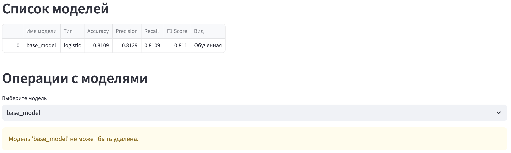
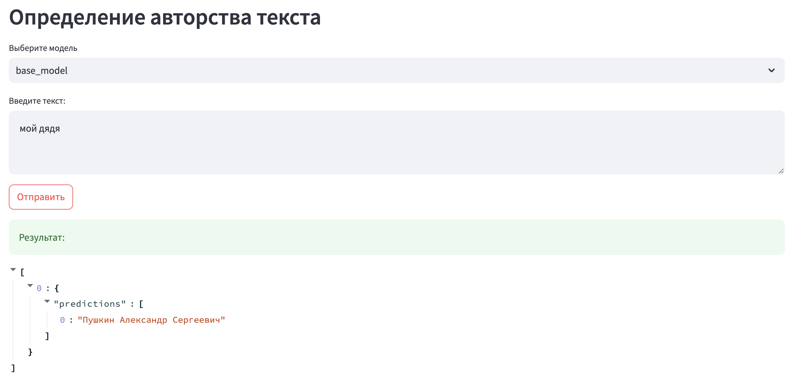

### Документация проекта

#### Структура проекта
В корне расположены следующие директории:
- `api_backend`: серверная часть, реализующая функционал API;
- `client`: клиентская часть, реализующая функционал Streamlit-приложения;
- `data`: вспомогательные материалы (например, скриншоты для отчетов);
- `notebooks`: .ipynb ноутбуки, содержащие анализ данных, эксперименты и тесты;
- `parser`: реализация загрузки исходного датасета текстов отечественных классиков.

Также отображены отчетные файлы `.md` к различным чекпойнтам.

#### Реализация серверной части
Директория `api_backend` включает следующие поддиректории и файлы:
1. `/serializers/serializers.py` - содержит описание классов-моделей `pydantic`, определяющих структуру запросов и ответов сервиса.
2. `/services` - включает бизнес-слои сервиса:
- `/metrics.py` - функции, направленные на предобработку сырого текста (очистка от лишних пробелов / символов, токенизация, лемматизация, векторизация с помощью модели `Word2Vec`) и вычисление числовых признаков текста (количество слов, средняя длина предложений, средняя длина слов);
- `/model_history.py` - функции, направленные на логгирование истории загрузки моделей в файловую систему.
3. `/api/v1/api_route.py` - инициализация роутера и ручек сервиса. 
Файл содержит также вспомогательные функции для декомпозиции кода:
- `prepare_pipeline`: на основе типа модели и ее конфигураций возвращает объект `sklearn.pipeline` со стандартизатором. На данный момент поддерживается только тип `logistic`;
- `process_texts`: очищает входные тексты (используя функции предобработк из `/service/metrics.py`), учитывая поступивший список авторов из целевой переменной. Возвращает очищенный текст, а также леммы;
- `prepare_features`: подготоваливает данные для дальнейшего обучения модели - список лемм и числовые признаки на основе очищенного текста.
Перечень ручек сервиса:
- `/fit_csv`: обучает модель на основе загруженного пользователем CSV файла. Включает преобработку текстов и формирование пайплайна на основе вспомогательных функций. Далее разделяет данные на тренировочную и тестовую выборку, применяет векторизацию токенов, обучает пайплайн и вычисляет метрики качества, сохраняя модель в хранилище и логгируя историю создания модели.
- `/predict_request`: предоставляет для заданных в JSON текстов и id моделей предсказания. Входные тексты проходят все необходимые этапы предобработки для формирования валидного набора признаков.
- `/list_models`: выводит список созданных моделей с данными о них - имя, тип, вид и метрики качества.
- `/remove/{model_id}`: удаление модели по ее идентификатору из хранилища и логов.
4. `/main.py` - инициализация FastAPI приложения, точка входа в серверную часть проекта.

#### Streamlit-приложение
Приложение содержит четыре раздела, представленных в боковом меню "Навигация" и предоставляющих конкретный функционал:
1. "Модели"
На странице отображается список доступных моделей в табличном виде с дополнительной информацией о них (имя, тип, вид и метрики качества). По умолчанию при запуске сервиса подгружается готовая обученная `base_model` - безлайн, реализуемый в `/notebooks/baseline_pipeline.ipynb`. 
Также на странице пользователь может совершить операции с доступными моделями, которые отображаются в выпадающем списке. Под операцией подразумевается удаление модели. Базовая модель `base_model` не может быть удалена! 
Код реализован в `client/streamlit_app/models.py`. Список моделей использует ручку сервиса `/api/v1/models/list_models`. Операция удаления использует ручку сервиса `/api/v1/models/remove/{selected_id}`.
2. "Загрузка данных и EDA":
Пользователь может самостоятельно подгрузить датасет в формате `.csv` (действует ограничение в 1 Гб) для дальнейшего разведочного анализа. 
После загрузки файла на странице отображается информация о датасете:
- первые 5 строк в блоке *"Просмотр данных"*;
- статистическое описание (метод `describe()`) и визуализации (гистограммы распределения для числовых колонок) в блоке *"Разведочный анализ данных (EDA)"*.

Код реализован в `client/streamlit_app/load_dataset.py`.
3. "Создание модели":
На базе загруженного в предыдущем разделе датасета можно обучить модель. Для этого необходимо указать следующие данные:
- Имя модели (ее фактический идентификатор);
- Тип модели (на данный момент поддерживается только логистическая регрессия `logistic`);
- Гиперпараметры: solver (алгоритм для использования в задаче оптимизации, на данный момент поддерживается только `liblinear`) и максимальное количество итераций (ползунок диапазоном $[100;\ 1000]$).

Код реализован в `client/streamlit_app/create_model.py`. Обучение модели использует ручку сервиса `/api/v1/models/fit_csv`.
4. "Инференс"
Данная страница предоставляет возможность получить предсказание для заданного текста. Пользователь может выбрать доступную модель из выпадающего списка по ее имени и ввести текст в поле. После нажатия кнопки отправления сервис предоставит результат предсказания авторства на выбранной модели. 
Код реализован в `client/streamlit_app/inference.py`. Список доступных моделей для получения предсказания использует ручку сервиса `/api/v1/models/list_models`. Предсказание использует ручку сервиса `/api/v1/models/predict_request`.

#### Инструкция по использованию сервиса
1. Ознакомьтесь с разделом "Streamlit-приложение" настоящего отчета;
2. Откройте [ссылку](http://130.193.46.198:8501/) для перехода в интерфейс Streamlit-приложения;
3. Заглавной является страница "Модели", которая при старте сервиса отображает только дефолтную `base_model`. Вы не можете ее удалить.

4. Вы можете сразу получить предсказание на дефолтной модели. Для этого через боковую панель "Навигация" перейдите в раздел "Инференс", где по умолчанию выбрана базовая модель. В поле введите текст, авторство которого Вы хотите определить. Нажмите кнопку "Отправить", после чего сервис выдаст json-представление результата предсказания дефолтной модели:

5. Если Вы хотите создать новую модель, необходимо предоставить датасет для обучения в формате `.csv` файла. Важно, чтобы целевая колонка (автор текста) имела название `target`. В качестве признака допускается только колонка к текстом. При загрузке файла страница предоставит первичную информацию о Вашем датасете:
(TODO скрин статистики и визуализаций)
6. После загрузки файла перейдите во вкладку "Создание модели" и установите желаемое имя модели, а также количество итераций, перетягивая ползунок. Остальные параметры (тип и Solver) проставлены по умолчанию. Нажмите кнопку "Обучить модель". В случае, если на предыдущем шаге был загружен невалидный файл, Вы получите ошибку обучения модели. 
7. После окончания обучения Вашей модели ее наличие можно проверить либо в списке моделей, либо в "Инференсе" среди доступных для формирования предсказаний моделей. Дальнейшие действия аналогичны работе с дефолтной `base_model`.